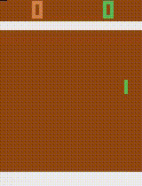
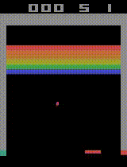
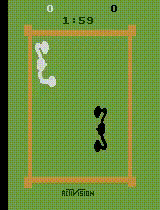
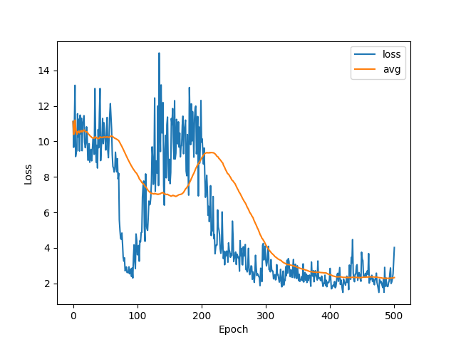
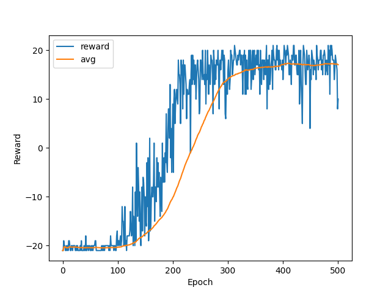
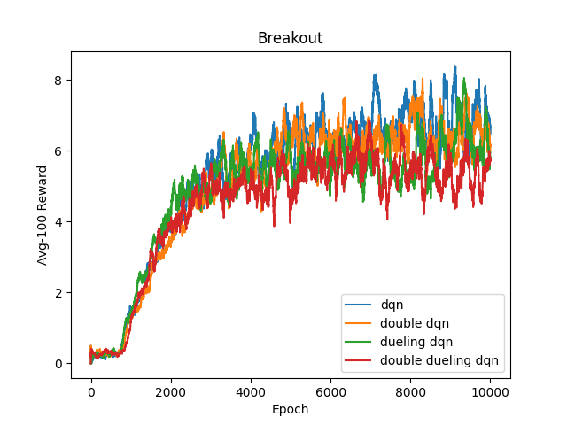
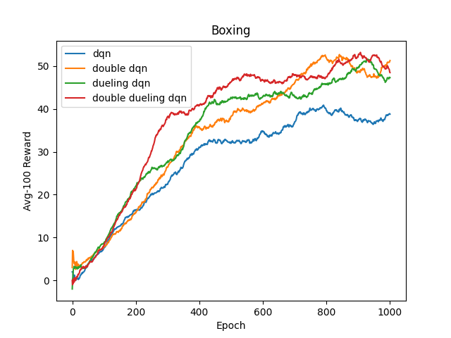

# Atari-DQN

This is my PyTorch implementation of DQN, DDQN and Dueling DQN to solve Atari games including PongNoFrameskip-v4, BreakoutNoFrameskip-v4 and BoxingNoFrameskip-v4.

<div align=center>

</div>

## 1. Install

```
# 1. Create a conda virtual environment.
conda create -n rl python=3.9 -y
conda activate rl

# 2. Install PyTorch (I use PyTorch 2.0 built under cuda 11.8).
# Some older versions should work well too.
conda install pytorch torchvision pytorch-cuda=11.8 -c pytorch -c nvidia

# 3. Install gymnasium and other package.
pip install 'gymnasium[atari]'
pip install gymnasium[accept-rom-license]
pip install opencv-python
pip install imageio[ffmpeg]
pip install matplotlib
```

## 2. Run

Recommendation:

- pong (double dueling dqn): `python main.py --env-name pong --model dueldqn --ddqn --epoch 501 --eval-cycle 50`
- breakout (dqn): `python main.py --env-name breakout --model dqn --epoch 10001 --eval-cycle 500`
- boxing (double dueling dqn): `python main.py --env-name boxing --model dueldqn --ddqn --epoch 1001 --eval-cycle 100`

A log file, models, videos, loss and reward pictures will be saved to corresponding folders.

## 3. Results

After training, the program will generate loss and reward pictures which look like: (pong, dueling dqn + ddqn)

<div align=center>

</div>
I also compare different models in each game except Pong.

<div align=center>

</div>

- Only double dueling dqn seems to converge in Pong (Even sometimes it doesn't converge either). I think it is due to the fact that in Pong most transitions have reward 0, so it is hard for the agent to sample some meaningful transitions. Priority experience replay (PER) may be a great solution to it. 
- Models that do relatively better in Breakout do relatively worse in Boxing.

## 4. Details

**Overall process** (some ideas of DQN/DDQN)

- First `WARMUP` steps, the agent will randomly choose action and warm up replay buffer.

- Every epoch, the agent will play the game once. Every step, it will choose action according to the policy network ($\epsilon$-greedy), store the transition ($s_t,a_t,r_t,s_{t+1}$) to the buffer and sample a batch of transitions to update the policy network (TD methods). $$DQN:Q(s_t,a_t)\leftrightarrow r_t+\gamma*\max_a Q'(s_{i+1},a)$$ $$DDQN:Q(s_t,a_t)\leftrightarrow r_t+\gamma*Q'(s_{t+1},\mathop{\arg\max}\limits_{a}Q(s_{t+1},a))$$

- Every fixed steps, $\epsilon$ will decay and the target network will be set to be the same as the policy network.

**Tricks**

- preprocess images
  - convert RGB to gray scale (color information is unnecessary)
  - rescale to 84*84 (faster training, less burden on replay buffer)
  - stack 4 pictures together (learn temporal information)
  - crop top and bottom of the image (scores information is unnecessary)
  - normalize the image from [0,255] to [0,1], which helps neural network to learn
- Atari wrappers
  - NoopResetEnv: Since Atari games are deterministic, do random number of no-ops first when reseting to add randomness, which can avoid overfitting.
  - FireResetEnv: It is hard for the Breakout agent to learn to fire and without firing the game will not begin at all. Therefore, we manually ask the agent to fire when reseting.
  - EpisodicLifeEnv: Some agents like the Breakout ones have more than one life. Terminate the game when they lose a life even though the game is not truly ended, hoping to help the agent avoid death.
  - MaxAndSkipEnv: The same action will be taken 4 (by default) times; Return every 4 frames and return the max between the two last frames. In this way, each episode will become shorter and more information is contained between adjacent frames.
  - ClipRewardEnv: Clip the reward to {+1, 0, -1} by its sign to make Atari games' rewards more uniform.

**Others**

With respect to some hyperparameters such as the decaying speed of epsilon, replay buffer's size, update target network frequency and `WARMUP` steps, I have tried a lot of different combinations when writing the code, but I think they actually don't matter much. You can find more experiment results from others' experiment [here](https://github.com/AdrianHsu/breakout-Deep-Q-Network).

